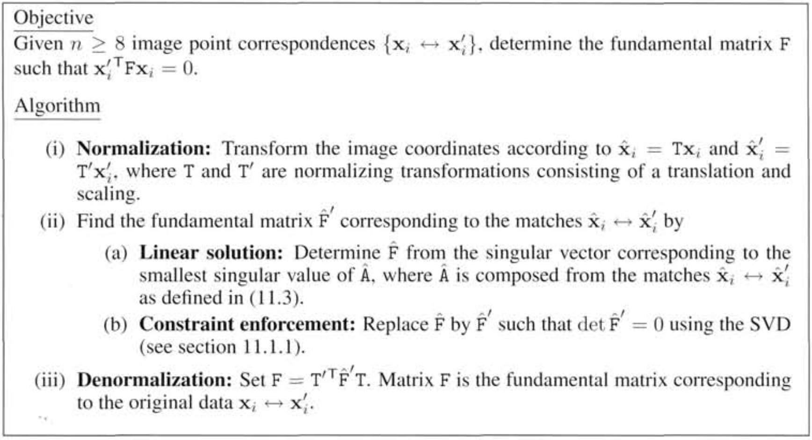
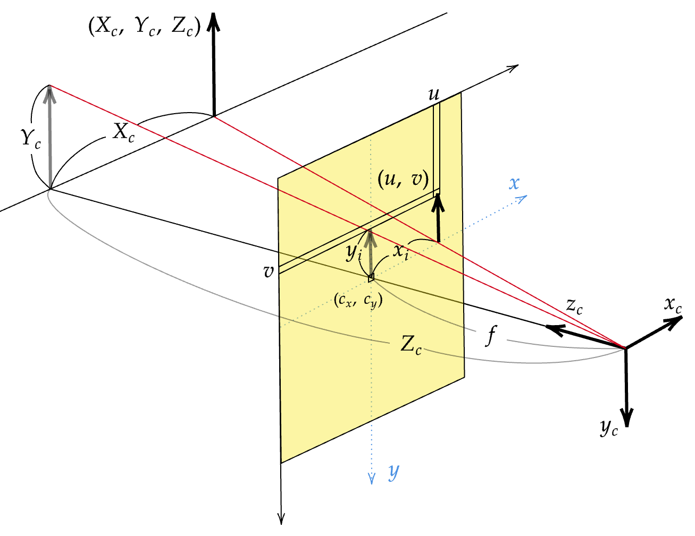
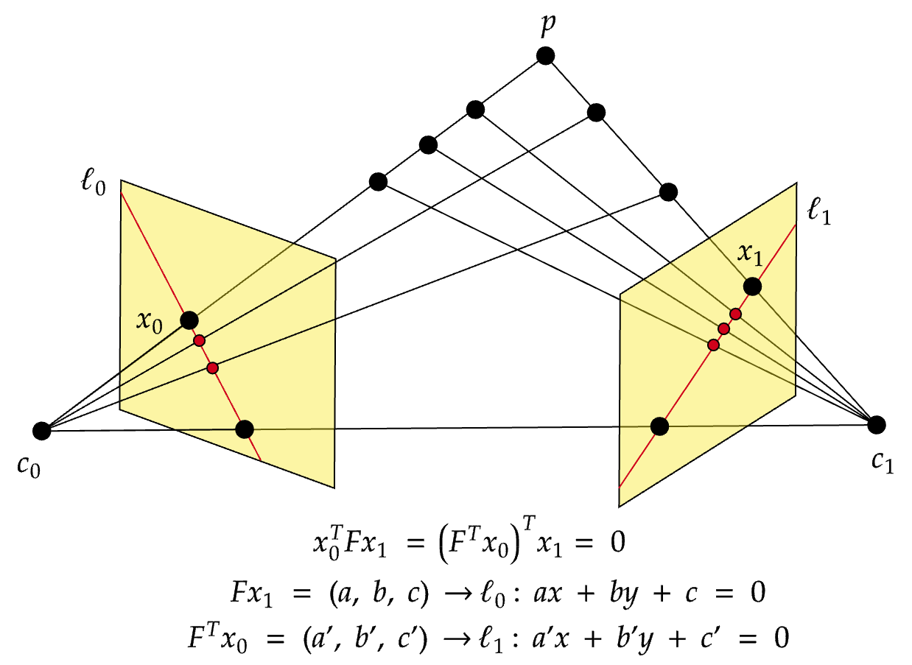

## Project Name 
Fundamental matrix estimation using the normalized 8-point algorithm and RANSAC. 


## Summary
Using the normalized 8-point algorithm and RANSAC, estimated the fundamental matrix and plotted the epipolar lines. The outputs may vary for different RANSAC runs. The details on the theory is provided below. 



## How to run
In the command line, run 
```console
python run.py
```
and the SIFT matches and the epipolar lines will be plotted. The images are named img1.jpg, img2.jpg and placed in the data directory. 

## Theory details

### Deriving the Camera Intrinsic Matrix $K$  

<figure>

</figure> 

Consider a point $P_w$ in the world coordinate system (i.e. distinct from the camera coordinate system). Let's first find the coordinate of $P_w$ with respect to the camera's 3D coordinate system. We will call $P_w$ in the camera coordinate system $P_c$. 

Let $R$ be the 3D rotation and $t$ be the translation of the world coordinate axis such that the world and camera coordinates coinside. Then using homogenous coordinates, it follows that

$$
\begin{equation}
\tag{1}
\begin{split}
P_c 
&= \left[
        \begin{matrix} 
        R & t \\
        0 & 1
        \end{matrix} 
        \right] P_w\\
\left(
\begin{matrix} 
X_c \\
Y_c \\
Z_c \\
1
\end{matrix} 
\right) 
&= \left [
        \begin{matrix} 
        R & t \\
        0 & 1
        \end{matrix} 
        \right ]
\left(
\begin{matrix} 
X_w \\
Y_w \\
Z_w \\
1
\end{matrix} 
\right) 
\end{split}
\end{equation}
.$$

 

Now, we will project $Pc$ onto the image plane and obtain its pixel coordinates. In the following, assume that the image sensor grid is not skewed (the pixels are rectangular). By the property of similar triangles (see figure at the top of the page), 

$$\frac{X_c}{Z_c} = \frac{x_i}{f}, \frac{Y_c}{Z_c} = \frac{y_i}{f}.$$

Therefore, 
$$x_i = f\frac{X_c}{Z_c}, y_i = f\frac{Y_c}{Z_c} .$$

Now, we will convert the coordinates on the image plane (unit length) to the coordinates on the image sensor (pixels). Let the pixel density in the $x$ direction be $m_x$ (pixels/unit length) and that in the $y$ direction be $m_y$ (pixels/unit length). Then the pixel coordinate of $(x_i, y_i)$ is

$$u = c_x + m_x x_i = c_x + (m_xf) \frac{X_c}{Z_c} = c_x + f_x \frac{X_c}{Z_c}$$
$$v = c_y + m_y y_i = c_y + (m_yf)\frac{Y_c}{Z_c} = c_y + f_y\frac{Y_c}{Z_c}.$$
Notice that this relationship can be re-expressed as 

$$\left(
\begin{matrix} 
u \\
v \\
1 \\
\end{matrix} 
\right) = \left(
\begin{matrix} 
f_x & 0 & c_x \\
0 & f_y & c_y \\
0 & 0 & 1 \end{matrix} \right) \left(
\begin{matrix} 
\frac{X_c}{Z_c} \\
\frac{Y_c}{Z_c}  \\
1 \\
\end{matrix} \right)$$

and

$$K = \left(
\begin{matrix} 
f_x & 0 & c_x \\
0 & f_y & c_y \\
0 & 0 & 1 \end{matrix} \right)$$

is the camera intrinsic matrix with skew $s = 0$.

If we multiply $Z_c$ on both sides, we have 

$$\begin{equation}\tag{2}
Z_c\left(
\begin{matrix} 
u \\
v \\
1 \\
\end{matrix} 
\right) = \left(
\begin{matrix} 
f_x & 0 & c_x \\
0 & f_y & c_y \\
0 & 0 & 1 \end{matrix} \right) \left(
\begin{matrix} 
X_c \\
Y_c  \\
Z_c \\
\end{matrix} \right)
= K \left(
\begin{matrix} 
X_c \\
Y_c  \\
Z_c \\
\end{matrix} \right)
\end{equation}.
$$

Since equation (1) is equivalent to 

$$\left(
\begin{matrix} 
X_c\\
Y_c \\
Z_c \\
\end{matrix} 
\right) = \left[
\begin{matrix} 
R & t \\
\end{matrix} \right] \left(
\begin{matrix} 
X_w \\
Y_w  \\
Z_w \\
1\\
\end{matrix} \right),$$

combining this with equation (2) we get 

$$Z_c\left(
\begin{matrix} 
u \\
v \\
1 \\
\end{matrix} 
\right) =K
\left[
\begin{matrix} 
R & t \\
\end{matrix} \right] \left(
\begin{matrix} 
X_w \\
Y_w  \\
Z_w \\
1\\
\end{matrix} \right) 
$$

and $P = [R\, t]$ is called the camera matrix. 

### The Fundamental Matrix $F$




Consider a 3D point $p$ that is viewed from two cameras $c_0$ and $c_1$ where the coordinate system of $c_0$ coinsides with that of $c_1$ by a 3D rotation $R$ and translation $t$. 

Let $p_0$ be the 3D vector from $c_0$ to $p$ and $p_1$ be the 3D vector from $c_1$ to $p$. Then it follows that 

$$p_1 = Rp_0 + t.$$

Now, from equation (2)

$$\frac{1}{Z_c} \left(\begin{matrix}
X_c\\
Y_c \\
Z_c \\
\end{matrix} \right) = K^{-1}\left(
\begin{matrix} 
u \\
v \\
1 \\ \end{matrix} \right).
$$

We can see that 

$$K^{-1}\left(
\begin{matrix} 
u \\
v \\
1 \\
\end{matrix} 
\right) $$

gives a 3D vector in the same direction as the vector from the camera center to the 3D point appearing as $(u, v)$ on the sensor.

Let $\hat{x}_0 = K_0^{-1}x_0$ and $\hat{x}_1 = K_1^{-1}x_1$. Then there exist scalars $d_0, d_1$ such that $p_0 = d_0 \hat{x}_0$ and $p_1 = d_1\hat{x}_1$. Then 

$$d_1\hat{x}_1 = R (d_0 \hat{x}_0) + t.$$

If we take the cross product with the 3D translation vector $t$ on both sides, 

$$d_1 (t \times \hat{x}_1) = d_0 (t \times R \hat{x}_0).$$

Then take the inner product with $\hat{x}_1$ on both sides and since $(t \times \hat{x}_1)$ is orthogonal to $\hat{x}_1$, it follows that 

$$
\begin{equation}
\tag{1}
\begin{split}
d_0 \hat{x}_1^T(t \times R \hat{x}_0)  
&= d_1 \hat{x}_1^T(t \times \hat{x}_1)\\
&= \hat{x}_1^T ([t] R) \hat{x}_0 \\
&= 0
\end{split} 
\end{equation}
$$

where $[t]$ is the matrix representation of $t \times$. The matrix $E = ([t] R)$ is called the essential matrix. 

Finally, we have

$$(K_1^{-1}x_1)^T E (K_0^{-1}x_0) = x_1^T (K_1^{-T}E K_0^{-1}) x_0 = 0$$

and $F = K_1^{-T}E K_0^{-1}$ is called the fundamental matrix, which relates two points in separate images planes representing the same 3D point. 

### Estimating the Fundamental Matrix $F$
Let $(u, v)$ and $(u', v')$ be pixel coordinates of the same 3D point on two separate image planes. Then from the discussion on the fundamental matrix we know 

$$\left(
\begin{matrix} 
u' & v' & 1 \\
\end{matrix} \right) F　\kern-1em \left(\begin{matrix} 
u \\ 
v \\
 1 \end{matrix}\right)  = 0$$

and with explicit elements for $F$

$$\left(\begin{matrix} 
u' & v' & 1 \\
\end{matrix}  \right)
\left(\begin{matrix} 
f_1 & f_2 & f_3 \\
f_4 & f_5 & f_6 \\
f_7 & f_8 & f_9 
\end{matrix}  \right)
\left(\begin{matrix} 
u \\ 
v \\
 1 \end{matrix}\right)  = 0.$$

Then 
$$f_1uu' + f_2vu' + f_3u'  + f_4uv' + f_5vv' + f_6v' + f_7u + f_8v + f_9 = 0.$$

Let $A$ be the matrix with rows consisting of the coefficinets of the $f_i$'s above obtained from the 2D point correspondences. Assuming $A$ has more than 9 rows and we are working with noisy data, our goal will be to solve not $A \boldsymbol{f} = 0$ but $\text{min } ||A \boldsymbol{f}||_2$ over $\boldsymbol{f}.$ Since $F$ is defined up to scale, we in fact will solve 

$$\text{min }  ||A \boldsymbol{f}||_2 \text{ over } \boldsymbol{f} \text{ where } ||\boldsymbol{f}||_2 = 1.$$ 

Now, since $A^TA$ is symmetric and thus has an eigendecomposition $A^TA = Q D Q^T$ where $Q^TQ = I$, it follows that

$$
\begin{equation}
\begin{split} 
(||A \boldsymbol{f} ||_2)^2
&= (A \boldsymbol{f} )^T(A \boldsymbol{f} ) &\\
&= \boldsymbol{f}^T (A^TA) \boldsymbol{f} & \\
&= \boldsymbol{f}^T (Q D Q^T) \boldsymbol{f} &\\
&= \boldsymbol{f}^TQ (D) Q^T \boldsymbol{f} &\\
&= (Q^T \boldsymbol{f})^T D (Q^T \boldsymbol{f}) &\\
&= y^T D y \quad &(y = Q^T \boldsymbol{f}) \\
&= \sum_i y_i^2 \lambda_i & \\
&\geq \lambda_n \sum_i y_i^2  &(\lambda_n \text{ : the smallest eigenvector of } A^TA)\\
&= \lambda_n & (\Sigma_i y_i^2 = 1)
\end{split} 
\end{equation}
$$

Thus, the smallest possible value for $||A \boldsymbol{f} ||_2$ is the square root of smallest eigenvalue $\lambda_n$ of $A^TA$ and this is achieved when $\boldsymbol{f}$ is the unit eigenvector of $A^TA$ corresponding to $\lambda_n$ [Demmel]. (Note: as singular values of $A$ are defined as $\sigma_i = \sqrt{\lambda_i}$ it follows that $\sigma_n = \sqrt{\lambda_n}$.)

Now that we found a candidate for $F_{est}$ (let's call it $F'$), note that the true $F$ is in fact rank 2 and the solution to our optimization problem is not necessarily so. In order to enforce this constraint, we need to slightly modify $F'$. Let $F' = S\Sigma V$ be the singular value decomposition of $F'.$ Then  based on the Eckart–Young–Mirsky theorem, the solution to [Zisserman]

$$\text{min } ||F' - F|| \text{  over rank 2 matrix } F \quad (\text{where } ||\cdot|| \text{ here is the Frobenius norm})$$

is the matrix $F_{est} = S \text{diag}(\sigma_1, \sigma_2, 0)V$ where the smallest singular value of $F'$ is set to zero. The matrix $F_{est}$ will be our final estimate for the fundamental matrix. 

### Normalization of pixel coordinates
It has been suggested in [Hartley] that estimating the fundamenal matrix can be improved by normalizing the pixel coordinates. Given the correspondence used to estimate $F$, find the mean and the standard deviation of the $u, v$ coordinates. Then for each $(u, v)$ subtract the mean and devide by the standard deviation. This transformation can be expressed as 

$$\left(\begin{matrix} 
u' \\ 
v' \\
 1 \end{matrix}\right)
= \left(\begin{matrix} 
s_u & 0 & 0 \\ 
0 & s_v & 0 \\
0 & 0 & 1
\end{matrix}\right)
 \left(\begin{matrix} 
1 & 0 & -c_u \\ 
0 & 1 & -c_v \\
0 & 0 & 1
\end{matrix}\right)
 \left(\begin{matrix} 
u \\ 
v \\
1
\end{matrix}\right).
 $$

We will perform this normalization at the beginning of our estimation. 

### Estimating the Fundamental Matrix with RANSAC
Finally, we will estimate the "best" fundamental matrix using RANSAC. Here, we will iteratively choose 9 correspondences and solve for $F$. Then, with our chosen tolerance, find the number of correspondences satisfying $x^TFx' \approx 0.$ We choose $F$ with the highest number of such inliers. The initial correspondences used to estimate $F$ are found through OpenCV's SIFT.


## References
- Computer Vision: Algorithms and Applications,  Richard Szeliski<br>
- Richard Hartley, Andrew Zisserman - Multiple View Geometry in Computer Vision-Cambridge University Press (2003) <br>
- James W. Demmel - Applied Numerical Linear Algebra-Society for Industrial and Applied Mathematics (1997).pdf <br>
- Richard I Hartley. “In defense of the eight-point algorithm”. In: IEEE Transactions on pattern analysis and machine intelligence 19.6 (1997), pp. 580–593. <br>
- https://docs.opencv.org/4.x/d9/d0c/group__calib3d.html <br>
- https://www.youtube.com/@firstprinciplesofcomputerv3258 <br>


